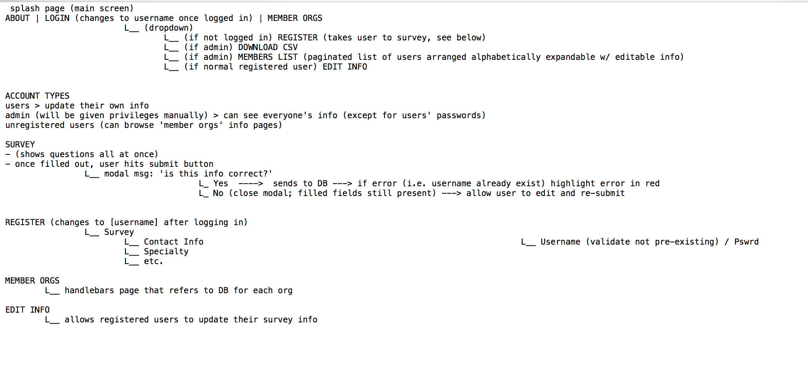
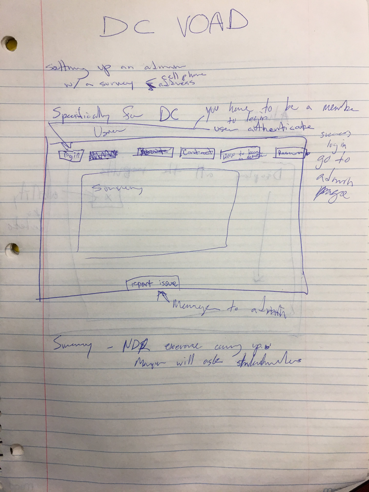
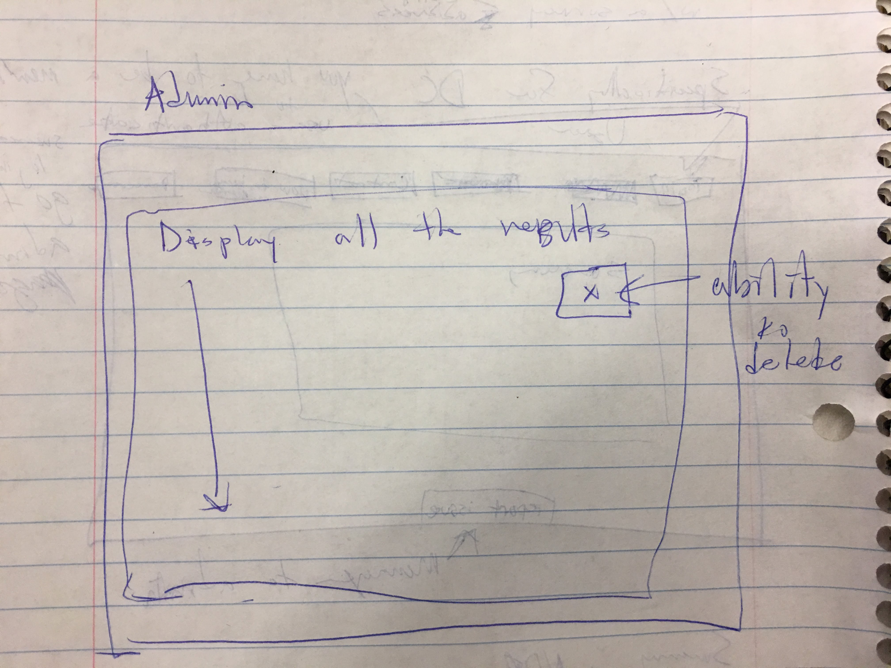
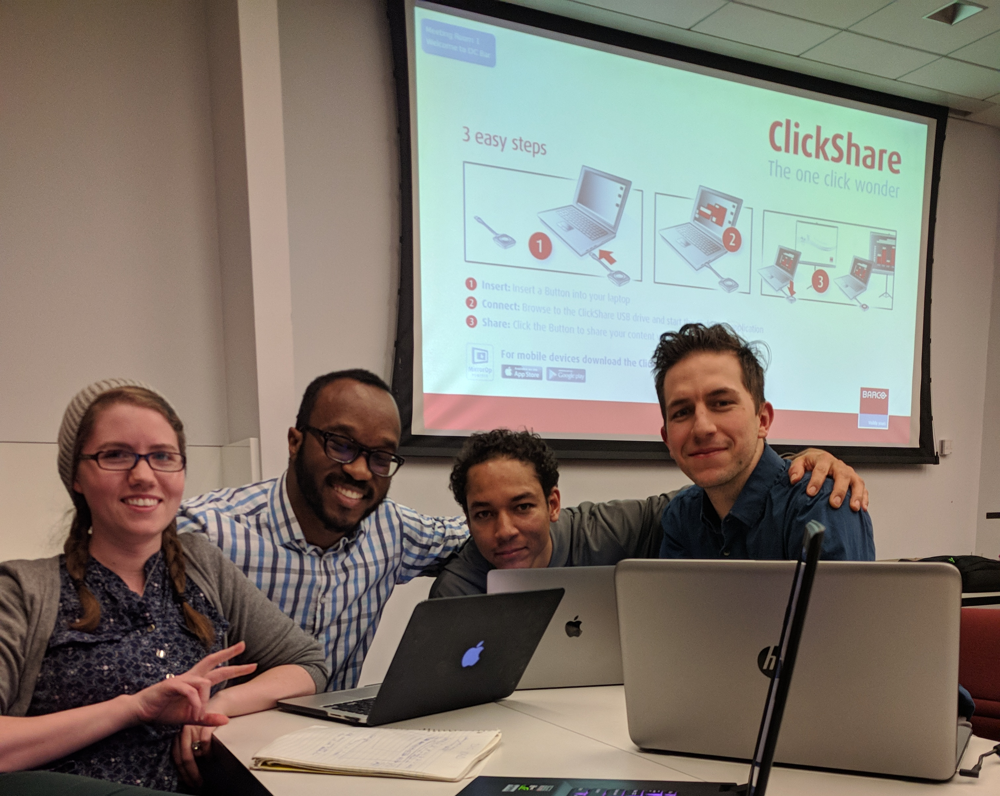

# Project Name
# Group Project 2
# DC VOAD (Voluntary Organization Active in Disaster)

## Description
Informational and functional website for organization wherein clients can view various info (e.g. membership, photos); Create survey that will populate database (contact ph#; email; roles/emergency speciality); Users should be authenticated (maybe via google authenticate);

Website that allows personal affiliated w/ VOAD to organize in preparation for upcoming national disaster response exercise. Organizational leadership requires to be able to reach out to these individuals as needed, when Federal gov't ask for it.

## MVP 1
Survey that hits database and stores persistently
## MVP 2
Extra org info displayed on website
## MVP 3
Admin accounts/permissions
## MVP 4
Can see publicly 'safe' data

## Key Features
- Clients can view membership info;
- Become a member;
- Submit survey to database;
- Admins should securely be able to pull all info from database (CSV);

## Tech Used
- MySQL;
- Form Validation;
- Express
- Body-parser
- Handlebars
- CSS Grid
- Javascript
- NPM
- Node

## Architecture Diagram

# UI Mockups

## API Docs
Description of API and routes goes here...

## DB
ERD Diagram and or schema goes here.

## Getting Started
Instructions for installing, running tests, seeding the DB, setting up the config file goes here

## Team Members

- Jen (main concept and client requirements)
- Jamal (linking front to back)
- Nathan (back-end)
- Jon (aesthetics and documentation)
